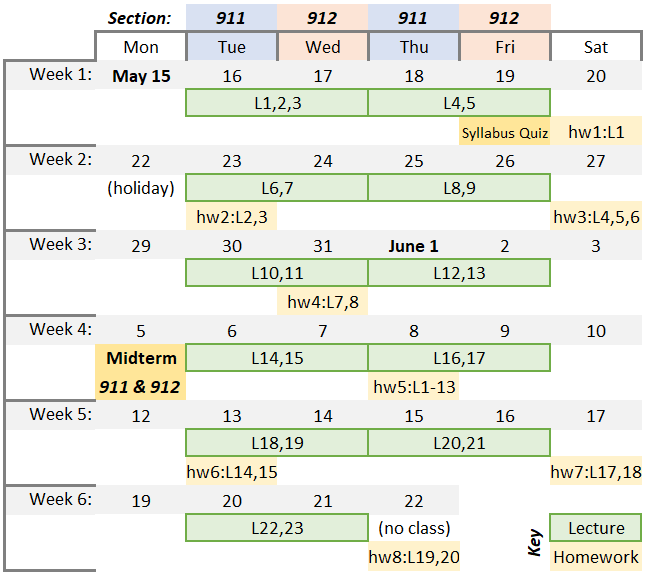

# UBC CPSC 330: Applied Machine Learning (2023s)

This is the course homepage for CPSC 330: Applied Machine Learning at the University of British Columbia. You are looking at the current version (May-June 2023). Some of the previous offerings are as follows:
- [2020w1](https://github.com/UBC-CS/cpsc330/tree/v2.0) by Mike Gelbart
- [2022s](https://github.com/UBC-CS/cpsc330-2022s) &nbsp;&nbsp; by Mehrdad Oveisi
- [2022w1](https://github.com/UBC-CS/cpsc330) by Varada Kolhatkar
- [2022w2](https://github.com/UBC-CS/cpsc330-2022W2) by Giulia Toti, Mathias Lecuyer, Amir Abdi

#### Instructor
Mehrdad Oveisi
- moveisi@cs.ubc.ca
- [LinkedIn.com/in/oveisi](https://www.linkedin.com/in/oveisi/)
- [Google Scholar](https://scholar.google.com/citations?user=6l2ij0IAAAAJ)
- ***Office hours***:
  - **When:** One hour after each class. For clarity, that will be potentially four hours per week. I will leave once there are no more questions.
  - **Where:** Office hours are held in the same classroom after each class.
  - **Who:** Students form both sections are welcome to attend all office hours.

#### Class Schedule
| Section | Day  | Lecture | Office Hour | Location |
|-|-|-|-|-|
| 911 | Tue, Thu  | 13:30 - 17:00 | 17:00 - 18:00 | [FSC 1005](https://ssc.adm.ubc.ca/classroomservices/function/viewlocation?userEvent=ShowLocation&buildingID=FSC&roomID=1005) |
| 912 | Wed, Fri  | 13:30 - 17:00 | 17:00 - 18:00 | [DMP 110](https://ssc.adm.ubc.ca/classroomservices/function/viewlocation?userEvent=ShowLocation&buildingID=DMP&roomID=110) |

#### Course Coordinator
Jeffrey Ho
- cpsc330-admin@cs.ubc.ca

Please email Jeffrey Ho at the above email address for all administrative concerns such as CFA accommodations, extensions or exemptions due to sickness or extenuating circumstances.

## License

© 2021 Varada Kolhatkar, Mike Gelbart, and Mehrdad Oveisi

Software licensed under [the MIT License](https://spdx.org/licenses/MIT.html), non-software content licensed under [the Creative Commons Attribution-NonCommercial-ShareAlike 4.0 International (CC BY-NC-SA 4.0) License](https://creativecommons.org/licenses/by-nc-sa/4.0/). See the [license file](LICENSE.md) for more information.

## Important links

* [Syllabus / administrative info](docs/course_info.md)
* [Calendar](https://htmlpreview.github.io/?https://github.com/UBC-CS/cpsc330-2023s/blob/2023s/docs/calendar.html)
* [Course GitHub page](https://github.com/UBC-CS/cpsc330-2023s)
* [Course Jupyter book](https://ubc-cs.github.io/cpsc330/lectures/01_intro.html#why-machine-learning-ml-video)
* [Course videos YouTube channel](https://www.youtube.com/playlist?list=PLHofvQE1VlGtZoAULxcHb7lOsMved0CuM)
* [Canvas](https://canvas.ubc.ca/courses/117814)
* [Gradescope](https://www.gradescope.ca/courses/10821)
* [Piazza](https://piazza.com/class/lh56brmyztm540) (this is where all **announcements** will be made)
* [*Setting up coding environment*](https://github.com/UBC-CS/cpsc330-2023s/blob/main/docs/setup.md)
* [Other course documents](https://github.com/UBC-CS/cpsc330-2023s/tree/main/docs)
* iClicker Cloud (available in Canvas)

## Compact course schedule (tentative)
|IMPORTANT NOTE|
|---|
||
| As a general rule, summer terms are quite compact and thus time management is crucial to keep up with the course content and the deadlines. More precisely, based on the [university calendar](https://vancouver.calendar.ubc.ca/dates-and-deadlines), the number of *Teaching Days* is 63 in winter terms and it is 28 in summer terms. That means there will be 2.25 (63÷28) times more content to learn per week, and **2.25 times faster pace** for the homework due dates. In other words, you are expected to learn and deliver the same amount of work compared to winter terms, but do it 2.25 times faster! For this reason, ***time management is of utmost importance in order to succeed in the course***. |

 

The following chart is a very compact version of the course tentative schedule.

&nbsp;
 

The following sections provide for more detailed course schedule.
 

## Deliverable due dates (tentative)

|Assessment  | Due date |  Where to find? | Where to submit? |
|-------|-----------|-----------|-----------|
| Syllabus quiz | May 19, 13:00  | [Canvas](https://canvas.ubc.ca/courses/117814) | [Canvas](https://canvas.ubc.ca/courses/117814) |
| hw1 | May 20, 13:00 |  [Github repo](https://github.com/UBC-CS/cpsc330-2023s/tree/main/hw/) | [Gradescope](https://www.gradescope.ca/courses/10821)|
| hw2 | May 23, 13:00 |   [Github repo](https://github.com/UBC-CS/cpsc330-2023s/tree/main/hw/) | [Gradescope](https://www.gradescope.ca/courses/10821)|
| hw3 | May 27, 13:00 |   [Github repo](https://github.com/UBC-CS/cpsc330-2023s/tree/main/hw/) | [Gradescope](https://www.gradescope.ca/courses/10821)|
| hw4 | May 31, 13:00  |   [Github repo](https://github.com/UBC-CS/cpsc330-2023s/tree/main/hw/) | [Gradescope](https://www.gradescope.ca/courses/10821)|
| **Midterm** | June 05,  13:30 to 15:00 | *Section 911*: [LIFE 2201](https://learningspaces.ubc.ca/classrooms/life-2201)   *Section 912*: [BIOL 1000](https://learningspaces.ubc.ca/classrooms/biol-1000) | [Canvas](https://canvas.ubc.ca/courses/117814) |
| hw5 | June 08, 13:00 |   [Github repo](https://github.com/UBC-CS/cpsc330-2023s/tree/main/hw/) | [Gradescope](https://www.gradescope.ca/courses/10821)|
| hw6 | June 13, 13:00 |   [Github repo](https://github.com/UBC-CS/cpsc330-2023s/tree/main/hw/) | [Gradescope](https://www.gradescope.ca/courses/10821)|
| hw7 | June 17, 13:00  |   [Github repo](https://github.com/UBC-CS/cpsc330-2023s/tree/main/hw/) | [Gradescope](https://www.gradescope.ca/courses/10821)|
| hw8 | June 22, 13:00 |   [Github repo](https://github.com/UBC-CS/cpsc330-2023s/tree/main/hw/) | [Gradescope](https://www.gradescope.ca/courses/10821) |
| **Final exam** | Jun 27, 08:30 | [Final exam schedule](https://students.ubc.ca/enrolment/exams/exam-schedule) | [Canvas](https://canvas.ubc.ca/courses/117814) |

## Lecture schedule (tentative)

**Lectures**: 
- The lectures will be in-person (see *Class Schedule* above for more details).
- All lecture files are subject to change without notice up until they are covered in class.
- You are expected to watch the "Pre-watch" videos before each lecture.
- You are expected to attend the lectures.
- You will find the lecture notes under the [lectures](./lectures/) in this repository. Lectures will be posted as they become available. 

|# | Date  | Topic | Assigned videos | vs. CPSC 340 |
|-|-|-|-|-|
|1 | May 16,17 | Course intro | 📹 <li>Pre-watch: None</li><li>Recap video (after lecture): [1.0](https://youtu.be/-1hTcS5ZE4w)</li> | n/a|
|  | | **Part I: ML fundamentals and preprocessing**  |
|2 | May 16,17 | Decision trees | 📹 <li>Pre-watch: [2.1](https://youtu.be/YNT8n4cXu4A), [2.2](https://youtu.be/6eT5cLL-2Vc)</li> <li>After lecture: [2.3](https://youtu.be/Hcf19Ij35rA), [2.4](https://youtu.be/KEtsfXn4w2E)</li>  |   less depth|
|3 | May 16,17 | ML fundamentals | 📹  <li> Pre-watch: [3.1](https://youtu.be/iS2hsRRlc2M), [3.2](https://youtu.be/h2AEobwcUQw)</li> <li>After lecture: [3.3](https://youtu.be/4cv8VYonepA), [3.4](https://youtu.be/Ihay8yE5KTI)</li>| similar |
|4 | May 18,19 | $k$-NNs and SVM with RBF kernel | 📹  <li> Pre-watch: [4.1](https://youtu.be/hCa3EXEUmQk), [4.2](https://youtu.be/bENDqXKJLmg)</li> <li>After lecture: [4.3](https://youtu.be/IRGbqi5S9gQ), [4.4](https://youtu.be/ic_zqOhi020)</li>| less depth |
|5 | May 18,19 | Preprocessing, `sklearn` pipelines | 📹  <li> Pre-watch: [5.1](https://youtu.be/xx9HlmzORRk), [5.2](https://youtu.be/G2IXbVzKlt8)</li><li>After lecture: [5.3](https://youtu.be/nWTce7WJSd4), [5.4](https://youtu.be/2mJ9rAhMMl0)</li> |  more depth|
|6 | May 23,24 | More preprocessing, `sklearn` `ColumnTransformer`, text features | 📹  <li> Pre-watch: [6.1](https://youtu.be/to2mukSyvLk), [6.2](https://youtu.be/hteVvLwrWZ4)</li>  | more depth |
|7 | May 23,24 | Linear models | 📹  <li> Pre-watch: [7.1](https://youtu.be/HXd1U2q4VFA), [7.2](https://youtu.be/56L5z_t22qE), [7.3](https://youtu.be/_OAK5KiGLg0)</li>  |   less depth |
|8 | May 25,26 | Hyperparameter optimization, overfitting the validation set | 📹  <li> Pre-watch: [8.1](https://youtu.be/lMWdHZSZMk8),[8.2](https://youtu.be/Z9a9XZ0vQv0)</li>   |   different|
|9 | May 25,26 | Evaluation metrics for classification  | 📹  <li> Pre-watch: [9.2](https://youtu.be/ZCuCErW5lI8),[9.3](https://youtu.be/XkCTUuoH23c),[9.4](https://youtu.be/jHaKRCFb6Qw)</li>| more depth |
|10 | May 30,31 | Regression metrics | 📹 <li>Pre-watch: [10.1](https://youtu.be/lgGTKLwNgkQ)</li>|   more depth on metrics less depth on regression|
|11 | May 30,31 | Ensembles | 📹 <li>Pre-watch: [11.1](https://youtu.be/8litm1H7DLo),[11.2](https://youtu.be/EkFkY9QB2Hw)</li>   | similar |
|12 | Jun 1,2 | Feature importances, model interpretation | 📹 <li>Pre-watch: [12.1](https://youtu.be/xfICsGL7DXE),[12.2](https://youtu.be/tiSN18OmZOo)</li>   | feature importances is new, feature engineering is new |
|13 | Jun 1,2 |   Feature engineering and feature selection | None  | less depth |
| | Jun 5 | **Midterm**  |  |
| |  | **Part II: Unsupervised learning, transfer learning, different learning settings**  ||
|14 | Jun 6,7 |   Clustering | 📹 <li>Pre-watch: [14.1](https://youtu.be/caAuUAXwpb8),[14.2](https://youtu.be/s6AvSZ1_l7I),[14.3](https://youtu.be/M5ilrhcL0oY)</li>   | less depth |
|15 | Jun 6,7 |   More clustering | <li> Post-lecture: [15.1](https://youtu.be/1ZwITQyWpkY), [15.2](https://youtu.be/T4NLsrUaRtg), [15.3](https://youtu.be/NM8lFKFZ2IU)</li> | less depth |
|16 | Jun 8,9 |   Simple recommender systems |None | less depth ||
|17 | Jun 8,9 |  Text data, embeddings, topic modeling  | 📹 <li>Pre-watch: [16.1](https://youtu.be/GTC_iLPCjdY),[16.2](https://youtu.be/7W5Q8gzNPBc)</li>   |   new |
|18 | Jun 13,14 | Neural networks and computer vision ||   less depth |
|19 | Jun 13,14 | Time series data | (Optional) [Humour: The Problem with Time & Timezones](https://www.youtube.com/watch?v=-5wpm-gesOY)| new |
|20 | Jun 15,16 | Survival analysis | 📹 (Optional but highly recommended) [Calling Bullshit 4.1: Right Censoring](https://www.youtube.com/watch?v=ITWQ5psx9Sw) |   new |
| | | **Part III: Communication, ethics, deployment**  ||
|21 | Jun 15,16  |  Ethics | 📹 (Optional but highly recommended) <li>[Calling BS videos](https://www.youtube.com/playlist?list=PLPnZfvKID1Sje5jWxt-4CSZD7bUI4gSPS) Chapter 5 (6 short videos, 50 min total)</li> <li>[The ethics of data science](http://jtleek.com/ads2020/week-15.html)</li>| new |
|22 | Jun 20,21 | Communication | 📹 (Optional but highly recommended) <li>[Calling BS videos](https://www.youtube.com/playlist?list=PLPnZfvKID1Sje5jWxt-4CSZD7bUI4gSPS) Chapter 6 (6 short videos, 47 min total)</li> <li>[Can you read graphs? Because I can't.](https://www.youtube.com/watch?v=vbDObzI-CTc) by Sabrina (7 min)</li> |   new |
|23 | Jun 20,21 | Model deployment and Conclusions ||  new |
|24 |  | (optional reading) Stochastic Gradient Descent |  |   |
|25 |  | (optional reading) Combining Multiple Tables |  |   |
