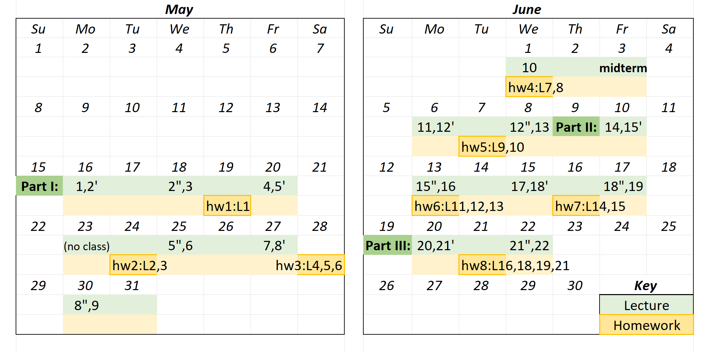

# UBC CPSC 330: Applied Machine Learning (2022s)

This is the course homepage for CPSC 330: Applied Machine Learning at the University of British Columbia. You are looking at the current version (May-June 2022). Some of the recent versions are as follows:
- [2020W1](https://github.com/UBC-CS/cpsc330/tree/v2.0) by Mike Gelbart
- [2021W1](https://github.com/UBC-CS/cpsc330) by Varada Kolhatkar
- [2021W2](https://github.com/UBC-CS/cpsc330-2021W2) by Giulia Toti.

#### Instructor
Mehrdad Oveisi
- ***email***: mehrdad.oveisi@ubc.ca
- ***office***: ICCS 255
- ***office hours***: one hour after each class

| Day  | Time   | Location |
|----------|--------|------|
| Mon Wed Fri  | 12:00 - 13:00 | [FSC 1005](https://ssc.adm.ubc.ca/classroomservices/function/viewlocation?userEvent=ShowLocation&buildingID=FSC&roomID=1005) |

#### Course Coordinator
Riley Knowles
- ***email***: cpsc330-admin@cs.ubc.ca

For all emails about CFA accommodations, extensions or exemptions due to sickness or extenuating circumstances, please email Riley Knowles at the above email address.

## License

© 2021 Varada Kolhatkar and Mike Gelbart

Software licensed under [the MIT License](https://spdx.org/licenses/MIT.html), non-software content licensed under [the Creative Commons Attribution-NonCommercial-ShareAlike 4.0 International (CC BY-NC-SA 4.0) License](https://creativecommons.org/licenses/by-nc-sa/4.0/). See the [license file](LICENSE.md) for more information.

## Important links

* [Course GitHub page](https://github.com/UBC-CS/cpsc330-2022s)
* [Course Jupyter book](https://ubc-cs.github.io/cpsc330/lectures/01_intro.html#why-machine-learning-ml-video)
* [Course videos YouTube channel](https://www.youtube.com/playlist?list=PLHofvQE1VlGtZoAULxcHb7lOsMved0CuM)
* [Canvas link](https://canvas.ubc.ca/courses/97562)
* Office hours on the course calendar on [Canvas](https://canvas.ubc.ca/courses/97562)
* [Syllabus / administrative info](docs/course_info.md)
* [Piazza](https://piazza.com/class/l2wy4l83juo5jo) (this is where all **announcements** will be made)
* [**Setting up coding environment**](https://github.com/UBC-CS/cpsc330-2022s/blob/master/docs/setup.md)
* [Other course documents](https://github.com/UBC-CS/cpsc330-2022s/tree/master/docs)
* [Past exams](https://github.com/UBC-CS/cpsc330-2022s/tree/master/exams)

## Deliverable due dates (tentative)

|IMPORTANT NOTE|
|---|
||
| As a general rule, Summer terms are quite compact and thus time management is crucial to keep up with the course content and the deadlines. For example, an offering of this course during the Winter terms has 3 hours of lecture per week, but during the summer there will be 7.5 hours of lecture per week. That means 2.5 times more content to learn per week, and **2.5 times faster pace** for the homework due dates. In other words, you are expected to learn and deliver the same amount of work compared to Winter terms, but do it 2.5 times faster! For this reason time management is of utmost importance in order to succeed in the course. |

|Assessment  | Due date |  Where to find? | Where to submit? |
|-------|-----------|-----------|-----------|
| Syllabus quiz | May 23, 18:00  | [Canvas](https://canvas.ubc.ca/courses/97562) | [Canvas](https://canvas.ubc.ca/courses/97562) |
| hw1 | May 19, 18:00 |  [Github repo](https://github.com/UBC-CS/cpsc330-2022s/tree/master/hw/) | [Gradescope](https://www.gradescope.ca/courses/5032)|
| hw2 | May 24, 18:00 |   [Github repo](https://github.com/UBC-CS/cpsc330-2022s/tree/master/hw/) | [Gradescope](https://www.gradescope.ca/courses/5032)|
| hw3 | May 28, 18:00   ~May 27~ |   [Github repo](https://github.com/UBC-CS/cpsc330-2022s/tree/master/hw/) | [Gradescope](https://www.gradescope.ca/courses/5032)|
| hw4 | June 01, 18:00   ~May 31~  |   [Github repo](https://github.com/UBC-CS/cpsc330-2022s/tree/master/hw/) | [Gradescope](https://www.gradescope.ca/courses/5032)|
| **Midterm** | June 03,  9:30 to 10:45 | Location: [CIRS 1250](https://learningspaces.ubc.ca/classrooms/cirs-1250)   More [Info on Piazza](https://piazza.com/class/l2wy4l83juo5jo?cid=131) | [Canvas](https://canvas.ubc.ca/courses/97562) |
| hw5 | June 07, 18:00 |   [Github repo](https://github.com/UBC-CS/cpsc330-2022s/tree/master/hw/) | [Gradescope](https://www.gradescope.ca/courses/5032)|
| hw6 | June 13, 18:00 |   [Github repo](https://github.com/UBC-CS/cpsc330-2022s/tree/master/hw/) | [Gradescope](https://www.gradescope.ca/courses/5032)|
| hw7 | June 16, 18:00  |   [Github repo](https://github.com/UBC-CS/cpsc330-2022s/tree/master/hw/) | [Gradescope](https://www.gradescope.ca/courses/5032)|
| hw8 | June 21, 18:00 |   [Github repo](https://github.com/UBC-CS/cpsc330-2022s/tree/master/hw/) | [Gradescope](https://www.gradescope.ca/courses/5032)|
| **Final exam** | TBD | TBD | TBD |

## Lecture schedule (tentative)

**Lectures**: The lectures will be in-person in [Forest Sciences Centre (FSC) 1005](https://ssc.adm.ubc.ca/classroomservices/function/viewlocation?userEvent=ShowLocation&buildingID=FSC&roomID=1005).

| Day  | Time   | Location |
|----------|--------|------|
| Mon Wed Fri  | 9:30 - 12:00  | [FSC 1005](https://ssc.adm.ubc.ca/classroomservices/function/viewlocation?userEvent=ShowLocation&buildingID=FSC&roomID=1005) |

- Try to watch the "Pre-watch" videos before each lecture.
- All lecture files are subject to change without notice up until they lecture is covered in class.

| Date  | Topic |  Assigned videos and datasets | vs. CPSC 340 |
|-------|-----------|-------------------------|------------------|
| May 16 | [Course intro](lectures/01_intro.ipynb) | 📹 <li>Pre-watch: None</li><li>During lecture: [1.0](https://youtu.be/-1hTcS5ZE4w)</li> | n/a|
|  | **Part I: ML fundamentals and preprocessing**  | |
|  | |**Datasets:** <li>[grade prediction toy dataset](lectures/data/quiz2-grade-toy-classification.csv)</li><li>[Canada USA cities toy dataset](lectures/data/canada_usa_cities.csv)</li> | |
| May 16, 18 | [Decision trees](lectures/02_decision-trees.ipynb) | 📹 <li>Pre-watch: [2.1](https://youtu.be/YNT8n4cXu4A), [2.2](https://youtu.be/6eT5cLL-2Vc)</li> <li>During lecture: [2.3](https://youtu.be/Hcf19Ij35rA), [2.4](https://youtu.be/KEtsfXn4w2E)</li> |   less depth|
| May 18 | [ML fundamentals](lectures/03_ml-fundamentals.ipynb) | 📹  <li> Pre-watch: [3.1](https://youtu.be/iS2hsRRlc2M), [3.2](https://youtu.be/h2AEobwcUQw)</li> <li>During lecture: [3.3](https://youtu.be/4cv8VYonepA), [3.4](https://youtu.be/Ihay8yE5KTI)</li>| similar |
|        |     |**Datasets:** <li>[California housing](https://www.kaggle.com/harrywang/housing)</li><li>[Spotify Song Attributes](https://www.kaggle.com/geomack/spotifyclassification/home)</li> | |
| May 20 | [$k$-NNs and SVM with RBF kernel](lectures/04_kNNs-SVM-RBF.ipynb) | 📹  <li> Pre-watch: [4.1](https://youtu.be/hCa3EXEUmQk), [4.2](https://youtu.be/bENDqXKJLmg)</li> <li>During lecture: [4.3](https://youtu.be/IRGbqi5S9gQ), [4.4](https://youtu.be/ic_zqOhi020)</li>  | less depth |
| May 20, 25 | [Preprocessing, `sklearn` pipelines](lectures/05_preprocessing-pipelines.ipynb) | 📹  <li> Pre-watch: [5.1](https://youtu.be/xx9HlmzORRk), [5.2](https://youtu.be/G2IXbVzKlt8)</li><li>During lecture: [5.3](https://youtu.be/nWTce7WJSd4), [5.4](https://youtu.be/2mJ9rAhMMl0)</li>  |  more depth|
|        |     | **Dataset:** <li>[California housing](https://www.kaggle.com/harrywang/housing)</li> | |
| May 25 | [More preprocessing, `sklearn` `ColumnTransformer`, text features](lectures/06_column-transformer-text-feats.ipynb) | 📹  <li> Pre-watch: [6.1](https://youtu.be/to2mukSyvLk), [6.2](https://youtu.be/hteVvLwrWZ4)</li> | more depth |
|        |     |**Datasets**: <li>[IMDB movie review](https://www.kaggle.com/lakshmi25npathi/imdb-dataset-of-50k-movie-reviews)</li> | |
| May 27 | [Linear models](lectures/07_linear-models.ipynb) | 📹  <li> Pre-watch: [7.1](https://youtu.be/HXd1U2q4VFA), [7.2](https://youtu.be/56L5z_t22qE), [7.3](https://youtu.be/_OAK5KiGLg0)</li> |   less depth |
|        |     |**Datasets**: <li>[Spotify Song Attributes](https://www.kaggle.com/geomack/spotifyclassification/home)</li><li>[Credit Card Fraud Detection](https://www.kaggle.com/mlg-ulb/creditcardfraud)</li> | |
| May 27, 30 | [Hyperparameter optimization, overfitting the validation set](lectures/08_hyperparameter-optimization.ipynb) | 📹  <li> Videos: [8.1](https://youtu.be/lMWdHZSZMk8),[8.2](https://youtu.be/Z9a9XZ0vQv0)</li> |   different|
| May 30 | [Evaluation metrics for classification](lectures/09_classification-metrics.ipynb)  | 📹  <li> Videos: [9.2](https://youtu.be/ZCuCErW5lI8),[9.3](https://youtu.be/XkCTUuoH23c),[9.4](https://youtu.be/jHaKRCFb6Qw)</li> | more depth |
|        |     |**Datasets**: <li>[Kaggle House Prices data set](https://www.kaggle.com/c/home-data-for-ml-course/)</li> <li>[Adult Census Income](https://www.kaggle.com/uciml/adult-census-income#)</li> | |
| June 01 | [Regression metrics](lectures/10_regression-metrics) |  📹 <li>Pre-watch: [10.1](https://youtu.be/lgGTKLwNgkQ)</li> |   more depth on metrics less depth on regression|
| June 03 | **Midterm**  |  |
| June 06 | [Ensembles](lecture/11_ensembles.ipynb) |  📹 <li>Pre-watch: [11.1](https://youtu.be/8litm1H7DLo),[11.2](https://youtu.be/EkFkY9QB2Hw)</li> | similar |
|        |     |**Datasets**: <li>[Adult Census Income](https://www.kaggle.com/uciml/adult-census-income#)</li>  | |
| June 06, 08 | [feature importances, model interpretation](lectures/12_feat-importances.ipynb) | 📹 <li>Pre-watch: [12.1](https://youtu.be/xfICsGL7DXE),[12.2](https://youtu.be/tiSN18OmZOo)</li> | feature importances is new, feature engineering is new |
|        |     | **Datasets**: <li>[Credit Card Dataset for Clustering](https://www.kaggle.com/arjunbhasin2013/ccdata)</li> | |
| June 08 |   [Feature engineering and feature selection](lectures/13_feature-engineering-selection.ipynb) | None | less depth |
|  | **Part II: Unsupervised learning, transfer learning, different learning settings**  | |
| June 10 |   [Clustering](lectures/14_k-means-clustering.ipynb) |  📹 <li>Pre-watch: [14.1](https://youtu.be/caAuUAXwpb8),[14.2](https://youtu.be/s6AvSZ1_l7I),[14.3](https://youtu.be/M5ilrhcL0oY)</li>  | less depth |
|        |  | **Datasets**: <li>[Jester 1.7M jokes ratings dataset](https://www.kaggle.com/vikashrajluhaniwal/jester-17m-jokes-ratings-dataset)</li> |
| June 10, 13 |   [Simple recommender systems](lectures/15_recommender-systems.ipynb) | | less depth ||
| June 13 |  [Text data, embeddings, topic modeling](lectures/16_natural-language-processing.ipynb)  | 📹 <li>Pre-watch: [16.1](https://youtu.be/GTC_iLPCjdY),[16.2](https://youtu.be/7W5Q8gzNPBc)</li>  |   new |
| June 15 | [Neural networks and computer vision](lectures/17_intro_to_computer-vision.ipynb) | |   less depth |
| June 15, 17 | [Time series data](lectures/18_time-series.ipynb) | (Optional) [Humour: The Problem with Time & Timezones](https://www.youtube.com/watch?v=-5wpm-gesOY) | new |
| June 17 | [Survival analysis](lectures/19_survival-analysis.ipynb) | 📹 (Optional but highly recommended)[Calling Bullshit 4.1: Right Censoring](https://www.youtube.com/watch?v=ITWQ5psx9Sw)|   new |
|  | **Part III: Communication, ethics, deployment**  | |
| June 20  |  [Ethics](lectures/20_ethics.ipynb) |   📹 (Optional but highly recommended) <li>[Calling BS videos](https://www.youtube.com/playlist?list=PLPnZfvKID1Sje5jWxt-4CSZD7bUI4gSPS) Chapter 5 (6 short videos, 50 min total)</li> <li>[The ethics of data science](http://jtleek.com/ads2020/week-15.html)</li>| new |
| June 20, 22 | [Communication](lectures/21_communication.ipynb) | 📹 (Optional but highly recommended) <li>[Calling BS videos](https://www.youtube.com/playlist?list=PLPnZfvKID1Sje5jWxt-4CSZD7bUI4gSPS) Chapter 6 (6 short videos, 47 min total)</li> <li>[Can you read graphs? Because I can't.](https://www.youtube.com/watch?v=vbDObzI-CTc) by Sabrina (7 min)</li> |   new |
| June 22 | [Model deployment and conclusion](lectures/22_deployment-conclusion.ipynb) |  |  new |

The following is a very compact version of the course tentative schedule:

## Working during the COVID-19 global pandemic

We are working together on this course during a global pandemic. Everyone is struggling to some extent. If you tell me you are having trouble, I am not going to judge you or think less of you. I hope you will extend me the same grace!

Here are some ground rules:

- If you are unable to submit a deliverable on time, please reach out (cpsc330-admin@cs.ubc.ca) **before** the deliverable is due.
- If you need extra support, the teaching team is here to work with you. Our goal is to help each of you succeed in the course.
- If you are struggling with the material, the new hybrid teaching format, or anything else, please reach out (via cpsc330-admin@cs.ubc.ca or the [instructor](mailto:mehrdad.oveisi@ubc.ca) directly). I will try to find time and listen to you empathetically.
- If I am unable to help you, I might know someone who can. UBC has some [great student support resources](https://students.ubc.ca/support).

### Covid Safety at UBC

**Masks:** This class is going to be (mostly) in person. Masks are required indoors, including in classrooms, as per the [BC Public Health Officer orders](https://www2.gov.bc.ca/gov/content/covid-19/info/restrictions#masks). For the purposes of this order, the term "masks" refers to medical and non-medical masks that cover our noses and mouths.  Masks are a primary tool to make it harder for Covid-19 to find a new host.  You will need to wear a medical or non-medical mask anytime you are indoors at UBC, for your own protection, and the safety and comfort of everyone else in the class. Please do not eat in the classroom. If you need to drink water/coffee/tea/etc, please keep your mask on between sips. Please note that there are some people who cannot wear a mask. These individuals are equally welcomed in our class.

**Seating in class:** To reduce the risk of Covid transmission, please sit in a consistent area of the classroom each day.  This will minimize your contacts and will still allow for the pedagogical methods planned for this class to help your learning.

**Questions after class:**
- We realize that many of you may have questions immediately after class and that this is a convenient time to ask them.
- To help increase the safety of everyone, please ***remain seated***, and your questions will be answered one by one.
- If you need to talk to or show something to the instructor or TAs, you can come to the front one by one.
- The classroom is booked for one hour after each class (12:00 - 13:00), so there will be enough time for all questions.
- Please vacate the room if your question(s) are answered and you are not planning to listen and learn from questions by other students. That is, please do not stay in the classroom for any other reason than course-related, after-class activities.
- Also, keep in mind that if you have questions about lecture content or operational aspects of the course, you can always post them to Piazza.

**Vaccination:** If you have not yet had a chance to get vaccinated against Covid-19, vaccines are available to you, free, and on campus [http://www.vch.ca/covid-19/covid-19-vaccine]. The higher the rate of vaccination in our community overall, the lower the chance of spreading this virus.  You are an important part of the UBC community. Please arrange to get vaccinated if you have not already done so.

**COVID-19 testing:** UBC will require COVID-19 testing for all students, faculty and staff, with exemptions provided for those who are vaccinated against COVID-19: [https://news.ubc.ca/2021/08/26/ubc-implements-vaccine-declaration-and-rapid-testing-for-covid-19/]

**Your personal health:**
If you're sick, it's important that you stay home – no matter what you think you may be sick with (e.g., cold, flu, other). A daily self-health assessment is required before attending campus. Every day, before leaving home, complete the self-assessment for Covid symptoms using [this tool](https://bc.thrive.health/covid19/en ).

Stay home if you have Covid symptoms, have recently tested positive for Covid, or are required to quarantine. You can check [this website](http://www.bccdc.ca/health-info/diseases-conditions/covid-19/self-isolation#Who) to find out if you should self-isolate or self-monitor.

**Your personal health:**
If you're sick, it's important that you stay home – no matter what you think you may be sick with (e.g., cold, flu, other). A daily self-health assessment is required before attending campus. Every day, before leaving home, complete the self-assessment for Covid symptoms using [this tool](https://bc.thrive.health/covid19/en ).

Stay home if you have Covid symptoms, have recently tested positive for Covid, or are required to quarantine. You can check [this website](http://www.bccdc.ca/health-info/diseases-conditions/covid-19/self-isolation#Who) to find out if you should self-isolate or self-monitor.

Your precautions will help reduce risk and keep everyone safer. In this class, the marking scheme is intended to provide flexibility so that you can prioritize your health and still be able to succeed:
- Attendance in classes and tutorials is not graded (although obviously beneficial when it is safe to attend).
- All course notes will be provided online.
- All homework assignments can be done and handed in online.
- Video recordings from previous terms are available [on YouTube](https://www.youtube.com/watch?v=-1hTcS5ZE4w&list=PLHofvQE1VlGtZoAULxcHb7lOsMved0CuM).
- There will be at least some office hours which will be held online.

**If sick on an exam day:**
If you are sick on a midterm exam day, please contact the course coordinator (cpsc330-admin@cs.ubc.ca) as soon as you are confident you should not come to the scheduled exam.  We would strongly prefer that you contact us to make an alternate arrangement than for you to come to the exam while you are ill.  If you do show up for an exam and you are clearly ill, you will not be able to write the exam and we will make alternate arrangements with you.  It is much better for you to email ahead of time and not attend.  Remember to include your full name and student number in your message.

If you are sick on a final exam day, **do not attend the exam**. You must apply for deferred standing (an academic concession) through Science Advising no later than 48 hours after the missed final exam/assignment. Students who are granted deferred standing write the final exam/assignment at a later date. Learn more and find the application online: https://science.ubc.ca/students/advising/concession

For additional information about academic concessions, see the UBC policy here:http://www.calendar.ubc.ca/vancouver/index.cfm?tree=3,329,0,0

## Official statement from UBC regarding the online learning experience:

>*During this pandemic, the shift to online learning has greatly altered teaching and studying at UBC, including changes to health and safety considerations. Keep in mind that some UBC courses might cover topics that are censored or considered illegal by non-Canadian governments. This may include, but is not limited to, human rights, representative government, defamation, obscenity, gender or sexuality, and historical or current geopolitical controversies. If you are a student living abroad, you will be subject to the laws of your local jurisdiction, and your local authorities might limit your access to course material or take punitive action against you. UBC is strongly committed to academic freedom, but has no control over foreign authorities (please visit http://www.calendar.ubc.ca/vancouver/index.cfm?tree=3,33,86,0 for an articulation of the values of the University conveyed in the Senate Statement on Academic Freedom). Thus, we recognize that students will have legitimate reason to exercise caution in studying certain subjects. If you have concerns regarding your personal situation, consider postponing taking a course with manifest risks, until you are back on campus or reach out to your academic advisor to find substitute courses. For further information and support, please visit: http://academic.ubc.ca/support-resources/freedom-expression.*

## Land Acknowledgement

UBC’s Point Grey Campus is located on the traditional, ancestral, and unceded territory of the xwməθkwəy̓əm (Musqueam) peple. The land it is situated on has always been a place of learning for the Musqueam people, who for millennia have passed on their culture, history, and traditions from one generation to the next on this site.

It’s important that this recognition of Musqueam territory and our relationship with the Musqueam people does not appear as just a formality. Take a moment to appreciate the meaning behind the words we use:

**TRADITIONAL** recognizes lands traditionally used and/or occupied by the Musqueam people or other First Nations in other parts of the country.

**ANCESTRAL** recognizes land that is handed down from generation to generation.

**UNCEDED** refers to land that was not turned over to the Crown (government) by a treaty or other agreement.

As you begin your journey at UBC, take some time to learn about the history of this land and to honour its original inhabitants.
